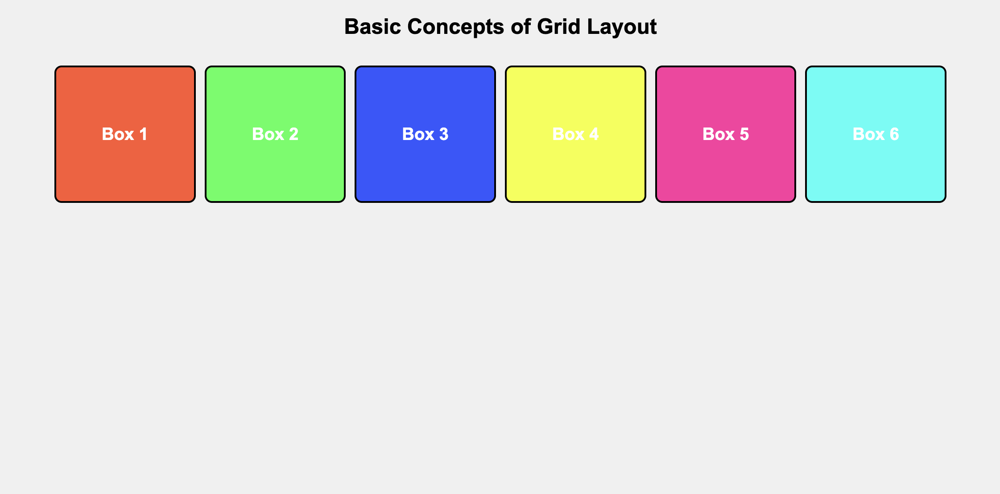

# Building with CSS Grid



## Description 📄
In this assignment you will create a responsive layout using CSS Grid. You'll learn how to set up your HTML and CSS files, include the necessary boilerplate code, and add CSS Grid code step-by-step.

## Expected Project Structure 🏗️

```plaintext
grid_layout_project
│   index.html
│   styles.css
```

## Instructions ✅

## 1. **Create the Project Folder and Files**
- [ ] Create a folder named `grid_layout_project` to store all your project files.
- [ ] Create a new HTML file named `index.html`. This will be your main HTML file.
- [ ] Create a new CSS file named `styles.css`. This file will contain the CSS used to style your HTML content.

## 2. **Add HTML Boilerplate**
Now that you have your files set up, start by adding the basic HTML5 boilerplate.

- [ ] Open your currently empty `index.html` file and add the following code to it.

   ```html
   <!DOCTYPE html>
   <html lang="en">
     <head>
       <meta charset="UTF-8" />
       <meta name="viewport" content="width=device-width, initial-scale=1.0" />
       <title>Basic Concepts of Grid Layout</title>
       <link rel="stylesheet" href="styles.css" />
     </head>
     <body>
       <!-- Your Grid Code Goes Here  -->
     </body>
   </html>
   ```

**Explanation:** 
- This section sets up the document as HTML5 and includes essential metadata and styles. It declares the document type, specifies the language, links to an external CSS file, and contains meta-information along with the main content of the page within the `<body>` tag.

## 3. **Add Body Content to HTML**

- [ ] In `index.html` between the `<body> </body>` tags, add the following content:

   ```html
       <h2>Basic Concepts of Grid Layout</h2>
       <div class="grid-container">
           <div class="box box1">Box 1</div>
           <div class="box box2">Box 2</div>
           <div class="box box3">Box 3</div>
           <div class="box box4">Box 4</div>
           <div class="box box5">Box 5</div>
           <div class="box box6">Box 6</div>
       </div>
   ```

**Explanation:** 
-  This block of `HTML` defines the main content of your page, introducing the grid layout section with a heading. 
It includes a `div` element with the class grid-container as the parent for six grid items, each represented by div elements with unique classes.
These grid items will be styled and positioned using CSS Grid.

## 4. **Add Basic Styling**

- [ ] Open `styles.css` and add the following code:

   ```css
   body {
     font-family: Arial, sans-serif;
     margin: 0;
     padding: 0;
     display: flex;
     flex-direction: column;
     align-items: center;
     min-height: 100vh;
     background-color: #f0f0f0;
   }

   h1 {
     margin-top: 20px;
     margin-bottom: 20px;
     font-size: 2rem;
     color: #333;
   }
   ```

**Explanation:** 

- This CSS sets the global styles for the page, including font settings, margin resets, and flexbox centering in the body selector. The `h1` selector adjusts the main heading's margins, font size, and color for enhanced readability.

## 5. **Setting Up the Grid Layout:**

- [ ] Add the following CSS to `styles.css` to create a responsive grid layout:

   ```css
   .grid-container {
     display: grid; /* This defines a grid container */
     grid-template-columns: repeat(auto-fill, minmax(150px, 1fr)); /* Creates responsive columns that fit the available space */
     gap: 10px; /* Adds a 10px gap between grid items */
     padding: 10px;
     max-width: 1000px;
     width: 100%;
   }

   .box {
     display: flex;
     justify-content: center;
     align-items: center;
     height: 150px;
     color: white;
     font-size: 1.2rem;
     font-weight: bold;
     text-align: center;
     border: 2px solid #000;
     border-radius: 8px;
   }
   ```

**Explanation:**
- The `.grid-container` class creates a flexible grid layout with responsive columns, spacing, and controlled size. The `.box` class centers content in each grid item using flexbox, with a fixed height, bold text, and rounded borders for a clean appearance.

## 6. **Adding Colors to the Boxes**

- [ ] Add the following CSS to `styles.css` to style the individual boxes:

   ```css
   .box1 {
     background-color: #ff5733;
   } /* Red-Orange */
   .box2 {
     background-color: #33ff57;
   } /* Green */
   .box3 {
     background-color: #3357ff;
   } /* Blue */
   .box4 {
     background-color: #f3ff33;
   } /* Yellow */
   .box5 {
     background-color: #ff33a1;
   } /* Pink */
   .box6 {
     background-color: #33fff5;
   } /* Cyan */
   ```

**Explanation:**

- These CSS classes (`.box1`, `.box2`, etc.) apply distinct background colors to each of the boxes within the grid. The colors are chosen to make each box stand out, enhancing the visual appeal and making it easy to distinguish between different grid items.

## 7. **Testing Your Layout**
By resizing the browser window and adding more boxes, you can observe how the grid behaves across different screen sizes, ensuring that the layout remains consistent and functional on any device.

- [ ] Resize the browser window to see how the grid adapts to different screen sizes.
- [ ] Copy and paste the HTML boxes a few more times to see the grid expand and wrap into the next line.
- [ ] Resize the window to see the grid automatically resize. This step is crucial for testing the responsiveness of your grid layout.

## 8. **Commit and Push to Github**
- [ ] Commit and push your work to Github.

# Conclusion 📄

In this activity, you explored the power of CSS Grid by defining a flexible grid structure.

You learned how to control both rows and columns, apply consistent spacing, and style grid items effectively.

The exercise highlighted how CSS Grid allows for easy adaptation to different screen sizes, providing a robust tool for building complex, adaptable web layouts.

If you have any questions or need further explanations, feel free to ask the AI for help. Here are some examples of what you might ask:

- "How do I create a grid layout with CSS Grid?"
- "How can I ensure my layout is responsive?"

Good luck, and have fun building with CSS grid!

##

### Solution codebase 👀
🛑 **Only use this as a reference** 🛑

💾 **Not something to copy and paste** 💾

**Note:**  This lab references a solution file located [here](https://github.com/HackerUSA-CE/aisd-wde-5-building-with-css-grid/tree/solution) (link not shown).

---

© All rights reserved to ThriveDX
